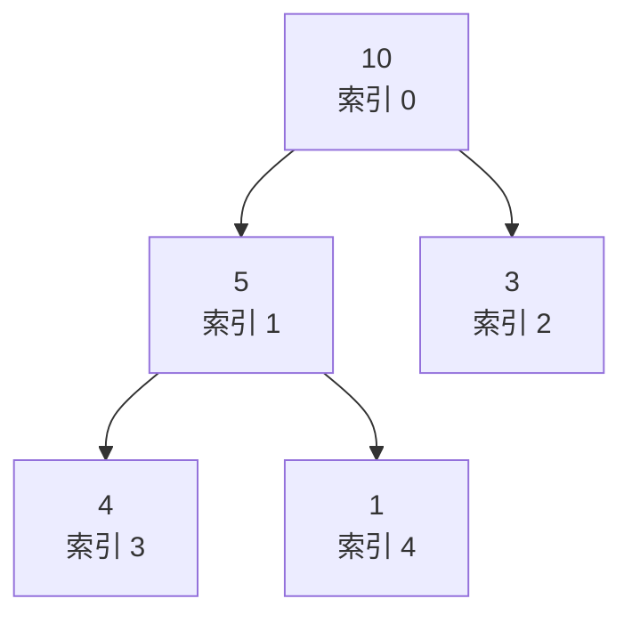

面试中常考的两种排序算法，一种是堆排序，一种是快速排序。这篇文章结合代码和图解，把两者的**原理、建堆/分区过程、复杂度**都讲清楚。

## 一、堆排序

个人理解，堆排序可以拆成两步：**建堆** + **排序**。在讲这两步之前，得先搞懂"堆"到底是什么。

### 1.1 什么是堆

堆分为两种：

- **大根堆**（最大堆）：每个结点都**大于它的所有孩子结点**。
- **小根堆**（最小堆）：每个结点都**小于它的所有孩子结点**。

堆还有一个硬性要求：它必须是一棵**完全二叉树**。完全二叉树的特点是——除最后一层外其余层都填满，最后一层的结点都靠左排列。

正因为它是一棵完全二叉树，它的层序编号和数组的下标天然一一对应，所以我们可以**直接用数组来存堆**，不需要真的去建一棵树。

### 1.2 完全二叉树与数组的对应关系

假设我们从索引 `0` 开始给结点编号，那么对于第 `i` 个结点：

- 左孩子索引：`2 * i + 1`
- 右孩子索引：`2 * i + 2`
- 父结点索引：`(i - 1) / 2`（向下取整；`int` 类型做除法默认就是向下取整）

以数组 `[10, 5, 3, 4, 1]` 为例，它对应的大根堆长这样：



可以看到：`10` 大于它的两个孩子 `5` 和 `3`，`5` 大于它的两个孩子 `4` 和 `1`，每个结点都满足"大于孩子"这条性质，所以它是个大根堆。

### 1.3 第一步：建堆

建堆的目标是：让每个结点都大于它的左右孩子（以大根堆为例）。这样一来，最大值一定会被一路"浮"到根结点。

这里有个关键技巧——**从最后一个非叶子结点开始，自下而上、从右往左依次"下沉"调整**。为什么要从非叶子结点开始？因为叶子结点没有孩子，天然满足堆性质，根本不用处理。

那最后一个非叶子结点是谁？就是最后一个索引 `n` 的父结点，即 `(n - 1) / 2`。

以 `[4, 10, 3, 5, 1]` 为例：`n = 4`，最后一个非叶子结点是索引 `(4 - 1) / 2 = 1`，也就是值 `10`。建堆过程如下：

![建堆过程：从最后一个非叶子结点开始自下而上下沉，最终得到大根堆 [10,5,3,4,1]](/images/sort/heap-build.svg)

所谓**下沉**（sift down），就是让当前结点和它的左右孩子里**最大的那个**比较：如果当前结点更小，就交换位置，然后对"被换下去的那个位置"继续下沉，直到满足堆性质为止。上图中 `4` 从索引 `0` 一路下沉到 `1`、再到 `3`，就是这个过程。

### 1.4 第二步：排序

建好堆之后，根结点就是当前最大值。排序就是不断重复下面这件事：

1. 把根结点（最大值）和堆的**最后一个元素**交换——最大值就被放到了末尾的正确位置；
2. 堆的大小减一（末尾那个已经排好，不再参与）；
3. 对新的根结点做一次下沉，重新恢复大根堆；
4. 重复 1~3，直到堆里只剩一个元素。


注意：这里是大根堆，所以是**把最大值放到末尾**，最终得到的是**升序**数组；如果想排成降序，就改用小根堆。

### 1.5 代码

```java
class Solution {
    public int[] sortArray(int[] nums) {
        int n = nums.length - 1;

        // 第一步：建堆
        // 从最后一个非叶子结点开始（即最后一个索引 n 的父结点 (n-1)/2），自下而上依次下沉
        for (int i = (n - 1) / 2; i >= 0; i--) {
            buildHeap(nums, n, i);
        }

        // 第二步：排序
        // 每次把堆顶（最大值）换到末尾，再对缩小的堆重新下沉调整
        for (int i = n; i > 0; i--) {
            swap(nums, 0, i);
            buildHeap(nums, i - 1, 0);
        }

        return nums;
    }

    // 下沉调整（堆化）：让下标 i 的结点大于它的左右孩子，若不满足就交换并继续下沉
    // n 表示当前堆的最大索引
    private void buildHeap(int[] nums, int n, int i) {
        int largest = i;       // 先假设当前结点最大
        int left = i * 2 + 1;  // 左孩子索引
        int right = i * 2 + 2; // 右孩子索引

        // 在 i、left、right 三者中找出最大的那个，记到 largest
        if (left <= n && nums[largest] < nums[left]) {
            largest = left;
        }
        if (right <= n && nums[right] > nums[largest]) {
            largest = right;
        }

        // largest != i 说明当前结点不是最大，需要交换；交换后对被换下去的位置继续下沉
        if (largest != i) {
            swap(nums, largest, i);
            buildHeap(nums, n, largest);
        }
    }

    // 交换位置
    private void swap(int[] nums, int i, int j) {
        int temp = nums[i];
        nums[i] = nums[j];
        nums[j] = temp;
    }
}
```

### 1.6 复杂度

- **建堆**：自底向上（从最后一个非叶子结点开始）的建堆是 `O(n)`，并不是直觉上的 `O(n log n)`。
- **排序**：共 `n` 次"交换 + 下沉"，每次下沉最多 `O(log n)`，所以是 `O(n log n)`。
- **总体**：`O(n log n)`（且最坏也是 `O(n log n)`，这是它比快排强的地方）。
- **空间**：`O(1)`，原地排序。
- **稳定性**：不稳定（交换时可能打乱相等元素的相对顺序）。

参考视频：[堆排序讲解](https://www.bilibili.com/video/BV1HYtseiEQ8)

## 二、快速排序

### 2.1 基本思想

快排用的是**分治**：每次挑一个**基准**（pivot），把比它大的元素放右边、比它小的放左边，这样 pivot 就落在最终正确的位置上；然后对左右两半**递归**做同样的事，直到区间为空或只剩一个元素。

### 2.2 分区过程（结合代码）

下面这段代码的"分区"写法比较有特点，它不是常见的双指针从两头往中间夹，而是**从右往左单指针扫描**：

```java
private void quickSort(int[] nums, int start, int end) {
    if (start >= end) {   // 递归终止：区间为空或只有一个元素
        return;
    }

    int pivot = nums[start]; // 取区间最左元素作为基准
    int index = end;         // index 指向"大于区"的左边界，最终也是 pivot 应放的位置

    // 从右往左扫描，遇到 > pivot 的元素就挪到右侧的"大于区"
    for (int i = end; i > start; i--) {
        if (nums[i] > pivot) {
            swap(nums, index, i);
            index--;
        }
    }
    // 此时 [index+1, end] 都 > pivot，[start+1, index] 都 <= pivot
    // 把 pivot 放到 index，pivot 就归位了
    swap(nums, start, index);

    quickSort(nums, start, index - 1); // 排左半
    quickSort(nums, index + 1, end);   // 排右半
}
```

这段代码的核心是那个 `index` 指针，可以这样理解它的**不变量**：

- `index` 从 `end` 开始，它始终标记着**"大于区"的左边界**——`index` 的右边（`index+1 .. end`）始终都是已经"收集"到的大于 pivot 的元素。
- 从右往左扫描 `i`：一旦发现 `nums[i] > pivot`，就把 `nums[i]` 和 `nums[index]` 交换，然后 `index--`。相当于"大于区"向左扩了一格。
- 扫描结束后，`[index+1, end]` 全部大于 pivot，而 `[start+1, index]` 这些位置要么本来就是 ≤ pivot，要么是被换过来的小元素。
- 最后 `swap(nums, start, index)` 把 pivot 放进 `index`，于是 pivot 左边的都 ≤ 它、右边的都 > 它，pivot 归位。

以 `[5, 3, 8, 1, 9, 7, 2]` 为例，`pivot = 5`、`index = 6`：


一步步走一遍：

1. `i=6`：`2` 不大于 5，跳过（留在左边）；
2. `i=5`：`7 > 5`，交换 `5↔6`，`7` 被挪到最右端，`index→5`；
3. `i=4`：`9 > 5`，交换 `4↔5`，`index→4`；
4. `i=3`：`1` 不大于 5，跳过；
5. `i=2`：`8 > 5`，交换 `2↔4`，`index→3`；
6. `i=1`：`3` 不大于 5，跳过；
7. 最后交换 `0↔3`，`5` 归位，得到 `[1, 3, 2, 5, 8, 9, 7]`。

此时 `5` 左边 `[1,3,2]` 都 ≤ 5，右边 `[8,9,7]` 都 > 5。再对左右两半分别递归，最终得到有序数组。

> 小细节：循环里 `if (nums[i] > pivot)` 用的是**严格大于**，所以等于 pivot 的元素会留在左边，重复元素也能正确排序；但当数组全是相等元素时，每次只能把区间缩小 1，会退化成 `O(n²)`（见下文优化）。

### 2.3 完整代码

```java
class Solution {
    public int[] sortArray(int[] nums) {
        quickSort(nums, 0, nums.length - 1);
        return nums;
    }

    // start 是当前区间最左索引，end 是最右索引
    // 取 nums[start] 作为基准 pivot，把 pivot 排到正确位置，
    // 让 pivot 左边的都 <= pivot、右边的都 > pivot，再对左右两半递归
    private void quickSort(int[] nums, int start, int end) {
        if (start >= end) {
            return;
        }

        int pivot = nums[start];
        int index = end; // 用来记录基准 pivot 需要交换的位置

        for (int i = end; i > start; i--) {
            if (nums[i] > pivot) {
                swap(nums, index, i);
                index--;
            }
        }
        swap(nums, start, index);

        quickSort(nums, start, index - 1);
        quickSort(nums, index + 1, end);
    }

    // 交换位置
    private void swap(int[] nums, int i, int j) {
        int temp = nums[i];
        nums[i] = nums[j];
        nums[j] = temp;
    }
}
```

### 2.4 复杂度与优化

- **平均时间复杂度**：`O(n log n)`。
- **最坏时间复杂度**：`O(n²)`。当数组**已经有序或逆序**时（比如 `[1,2,3,4,5]`，pivot 每次都是最值），每轮只把区间缩小 1，递归深度变成 `O(n)`。
- **空间复杂度**：`O(log n)`，来自递归调用栈。
- **稳定性**：不稳定。

常见的优化方向：

1. **随机选 pivot / 三数取中**：避免"每次取最左元素"在有序数组上退化成 `O(n²)`；
2. **三路快排**：把区间分成 `< pivot`、`== pivot`、`> pivot` 三段，大量重复元素时避免退化；
3. **小区间改用插入排序**：递归到长度很小的区间时，插入排序的常数更小；
4. **尾递归 / 迭代化**：减小递归栈深度。

## 总结

| 算法 | 平均时间 | 最坏时间 | 空间 | 稳定性 |
| --- | --- | --- | --- | --- |
| 堆排序 | `O(n log n)` | `O(n log n)` | `O(1)` | 不稳定 |
| 快速排序 | `O(n log n)` | `O(n²)` | `O(log n)` | 不稳定 |

堆排序胜在**最坏情况也是 `O(n log n)` 且原地**，但常数较大、缓存不友好；快排虽然最坏 `O(n²)`，但通过随机化优化后，**平均表现通常比堆排序更快**，是实际工程里更常用的选择。
